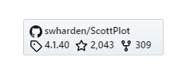

# GitHub Repo Badges

This project uses HTML and Vanilla JavaScript to dynamically create a badge you can include on your website to display project statistics for any public GitHub repository.

### Live Demo

https://swharden.github.io/repo-badge/

